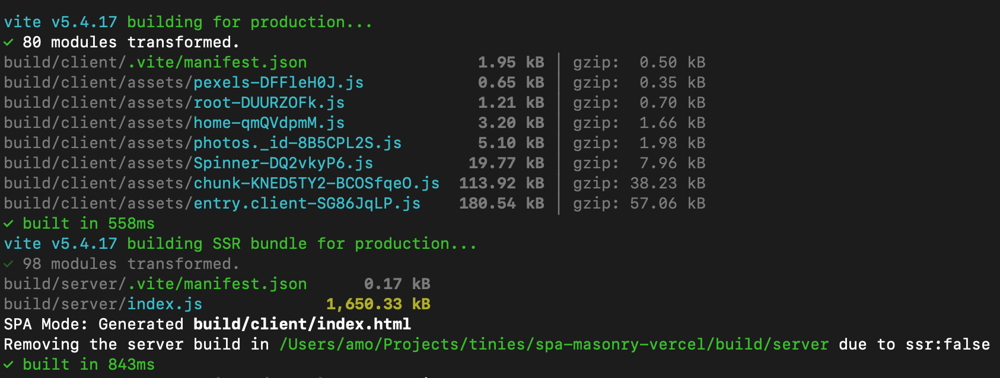
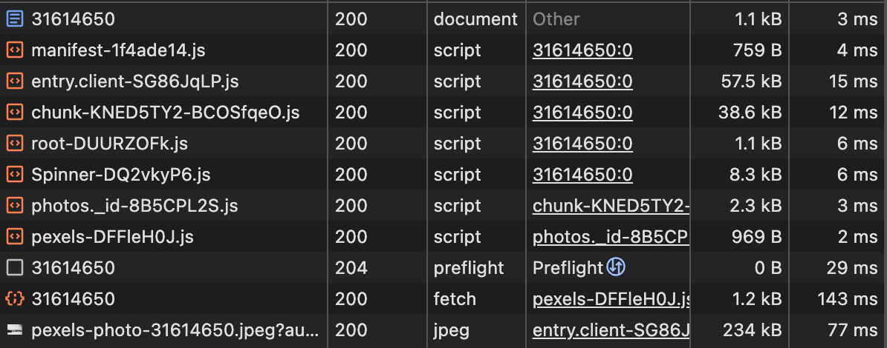

# Masonry Grid Photo Gallery

A Single Page Application (SPA) that showcases a responsive, optimized, and masonry grid layout along with a detailed view for photos.

## Features

- **Masonry Grid Layout**: A responsive grid that dynamically arranges photos fetched from the Pexels API, implemented without external layout libraries
- **Lazy Loading**: Only renders photos visible in the viewport, improving performance for large sets of images
- **Photo Details View**: Displays selected photos in a larger size with additional information
- **Search Functionality**: Allows users to search for photos by keywords
- **Responsive Design**: Fully responsive across all device sizes
- **Performance Optimized**: Focus on web vitals, bundle size, and avoiding unnecessary re-renders

## Technologies Used

- **React**: For building the user interface
- **TypeScript**: For type safety and better developer experience
- **React Router**: For navigation between the grid and detailed views
- **Emotion**: CSS-in-JS solution for styling components
- **Pexels API**: For fetching photos
- **Vitest**: For testing
- **ESLint**: For code linting
- **Prettier**: For code formatting

## Getting Started

### Prerequisites

- Node.js (v18 or higher)
- pnpm (v10 or higher)

### Installation

```bash
# Install dependencies
pnpm install

# To run the app in Producntion mode, set up your Pexels API key
# Create a .env file in the root directory and add:
PEXELS_API_KEY=your_api_key_here
```

### Development

```bash
# Start the development server
pnpm dev
```

Your application will be available at `http://localhost:5173`.

## Building for Production

```bash
# Create a production build
pnpm build

# Preview the production build
pnpm preview
```

## Design Decisions

Since performance optimization was the primary evaluation criterion, I concentrated on optimizing the masonry grid layout and implementing performance best practices, while dedicating less attention to accessibility and design aspects.

I opted not to use the [Pexels Javascript Library](https://github.com/pexels/pexels-javascript?tab=readme-ov-file) as it contains unnecessary code for this application. To avoid excessive Pexels API calls during development, I cached example API responses and served them directly from the development server.

My overall approach to performance optimization and maintainability focused on staying close to platform capabilities and minimizing code complexity.

To optimize the image loading and display, I've opted in [lazy loading](https://web.dev/articles/browser-level-image-lazy-loading) instead of the grid virtualization. It means using the single HTML attribute instead of the untrivial JavaScript logic. And it does the job of efficiently deferring content loading, even for the complex cases of the resizing the grid in the middle of the page. While virtualization shines when handling hundreds of computationally expensive nodes, this particular application benefits more from a highly optimized, easily maintainable solution that aligns with the requirements.

For the masonry grid layout, I combined a straightforward [CSS technique](https://css-irl.info/masonry-in-css/) with greedy image distribution across the columns to achieve a decent equality of their heights. While technically not a true masonry layout (which traditionally places elements in rows rather than columns), this approach is well-suited for this application since the images don't require strict ordering. Interestingly, Pexels' own [masonry grid implementation](https://www.pexels.com/collections/the-sea-aeqs4df/) also uses a column-based approach, though with heavy JavaScript logic. In the current implementation some script logic is needed to calculate columns which support infinite scrolling.

### Responsive Design

The application is fully responsive and adapts to different screen sizes. It uses ResizeObserver to adjust the grid layout based on the viewport width.

### Search Functionality

Search functionality is not implemented in this project.

### Tests

The project includes examples of unit tests using Vitest. To run the tests, use the following command:

```bash
pnpm test
```

or

```bash
pnpm test:browser
```

Note that the tests are by no means exhaustive, and more tests could be added to cover more aspects of the application. They are included as examples to demonstrate how Vitest can be used for testing.

### Image Loading

Images are loaded with the `loading="lazy"` attribute to defer loading of off-screen images. This improves the initial page load time and reduces the time to first meaningful paint (TTFP).
Images which are visible in the viewport are loaded with the `loading="eager"` attribute to ensure they are available as soon as possible.

### Performance Optimizations

- **Lazy Loading**: Images are loaded with the `loading="lazy"` attribute to defer loading of off-screen images.

- **Image Size Optimization**: Images are served in optimal sizes for each device. The system uses responsive images with appropriate srcset attributes. This significantly reduces data transfer and improves loading times.

- **Memoization**: React's `useCallback` and `useMemo` hooks are used to prevent unnecessary re-renders.

- **Pagination with infinite scrolling**: Photos are loaded in batches as the user scrolls, reducing initial load time.

- **CSS-in-JS Optimization**: Emotion's static extraction capabilities help reduce runtime CSS processing.

### Web Vitals Considerations

- **First Contentful Paint (FCP)**: Minimized by loading only essential CSS and JavaScript initially.

- **Largest Contentful Paint (LCP)**: Optimized by prioritizing the loading of visible images.

- **Cumulative Layout Shift (CLS)**: Reduced by pre-calculating image dimensions and maintaining aspect ratios.

- **Time to Interactive (TTI)**: Improved by deferring non-essential JavaScript execution.

## Observations on performance

### Production Build

Looking at the chunks in the production build, we can see that chunking works well.

### Production Build

Looking at the chunks in the production build, we can see that chunking works well.



Using `pnpm visualize` we can see the what's inside the chunks. As expected, the most of the application code is `react-dom` and `react-router`.

The `Spinner` component is used to show a loading spinner while the application is loading. It is extra things which can be removed, yet improves the user experience in case of slow network connections.

### Chrome DevTools

Network stats show 11 requests for the Photo Details Page. The performance bottleneck of the application is that the main content — the image — is loaded in the chain after the request to the API, so it delays LCP. More on this below.



### Lighthouse Reports

Here are the results of the Lighthouse audit:
[Report for PDP — desktop](./reports/PDP_lighthouse_report_desktop.html)
[Report for PDP — mobile](./reports/PDP_lighthouse_report_mobile.html)

Best Practices Score is below 80 due to the third-party cookies from Pexels.

The Performance Score is very good on Desktop, but it's not great on Mobile. The main issue is in the image loading — LCP can be very long on Mobile. The suggestion is to preload image, but in case of the CSR it's not possible. SSR could be a good solution for this. The request to API could be made on the server and cached. This would reduce the number of requests to the API and improve the response speed, additionally to the image preloading.

Other issues are more difficult to address:

- "Serve images in next-gen formats" — is is fully controlled by the API.
- "Page prevented back/forward cache restoration" is not an actionable issue.
- "Properly size images" — is difficult to address. The API returns images in different sizes. Most certainly is possible to find optimal values for the `srcset` attribute, but it would require deep exploration of the return values of API.

The discussion of the audit of the Grid Page is similar, and I'm leaving it for the interview.

## Future Improvements

- Implement unit tests for core components and utilities
- Enhance error handling
- Improve accessibility features
- Implement server-side rendering for better SEO and performance
- Add search functionality

## Rejection points
- The virtualization is not implemented
    _Lazy loading with pagination were considered reasonable for the application. Virtualization practically would matter for hundreds of images on the page (1000+ images @ 300KB each = 300MB memory), which is the case if users scroll > 100 pages._
    _I've tried to demonstrate understanding of the users' needs, awareness of the variety optimization techniques, their cost of implementation and maintainance and the ability to choose the best solution for the task._
- The infinite scroll is not working smoothly
    _The simple implementation was considered enough to demonstrate the concept. Improved._
- The masonry algorithm does not take into account the heights of items, so it can at the end that one column has longer height than the others
    _It actually does take into account the heights of items, but there was a bug in the calculation. Fixed._
- There are multiple files with more than one entries
    _One file contains utilities, which colocated by the purpose. Other files with multiple entries are required by the framework._
- Some of the components include also multiple reusable hooks
    _Hooks are reusable if they are used in multiple components. Since they are used once, they are colocated with the corresponding components._